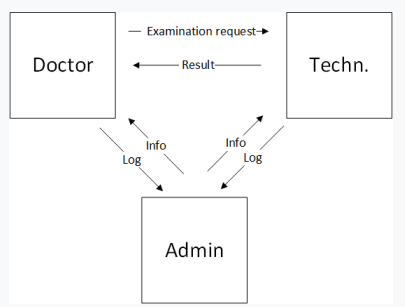
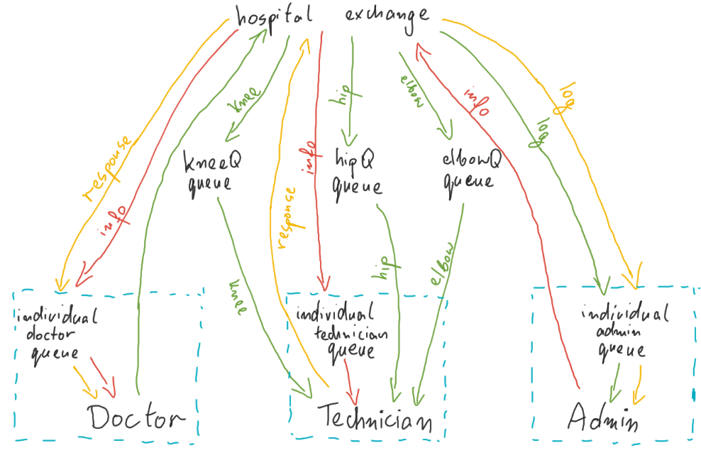

# Scenariusz: Obsługujemy oddział ortopedyczny w szpitalu

Szpital przyjmuje pacjentów z kontuzjami: biodra (hip), kolana (knee) lub łokcia (elbow)

## Mamy 3 typy użytkowników:

- Lekarz (zleca badania, dostaje wyniki)
- Technik (wykonuje badania, wysyła wyniki)
- Administrator (loguje całą aktywność, może wysyłać informacje do wszystkich)

### Lekarz:

- Wysyła zlecenie badania podając typ badania (np. knee) oraz nazwisko pacjenta, do dowolnego technika, który umie wykonać takie badanie
- Otrzymuje wyniki asynchronicznie

### Technik

- Każdy technik umie wykonać 2 typy badań, które podawane są przy starcie (np. knee, hip)
- Przyjmuje zgłoszenia danego typu i odsyła do lekarza zlecającego (wynik to nazwa pacjenta + typ badania + „done”)

Uwaga: jeśli jest dwóch techników z tym samym typem badania (np. knee) to wiadomość powinna być obsłużona tylko przez jednego (ale nie zawsze tego samego)

### Administrator

- Loguje całą aktywność (dostaje kopie wszystkich wiadomości – zleceń oraz odpowiedzi)
- Ma możliwość przesłania wiadomości (info) do wszystkich

## Diagram oczekiwanego rozwiązania

## Wymagania

Proszę przygotować rysunek ze schematem (użytkownicy, exchange, kolejki, wiadomości)
Schemat musi być przygotowany w wersji elektronicznej (skan rysunku nie jest dozwolony)

## Scenariusz testowy:

- 2 lekarzy
- 2 techników np. (knee, hip) oraz (knee, elbow)
- 1 administrator

